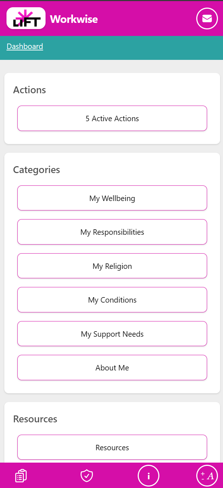
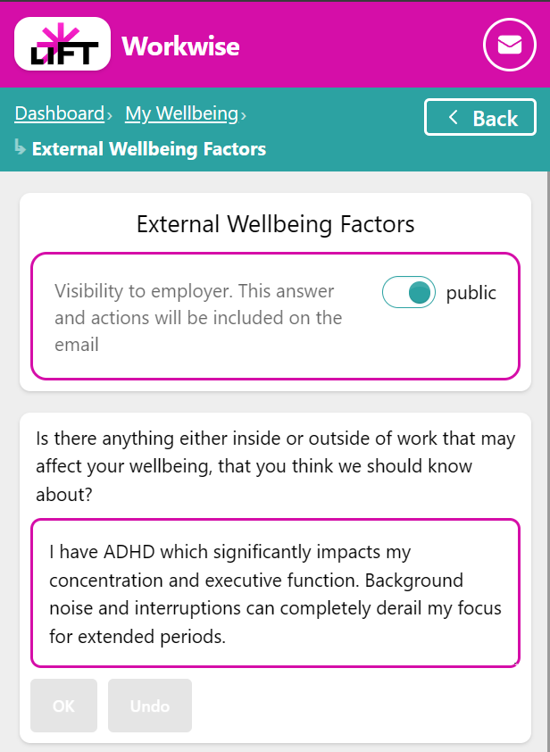
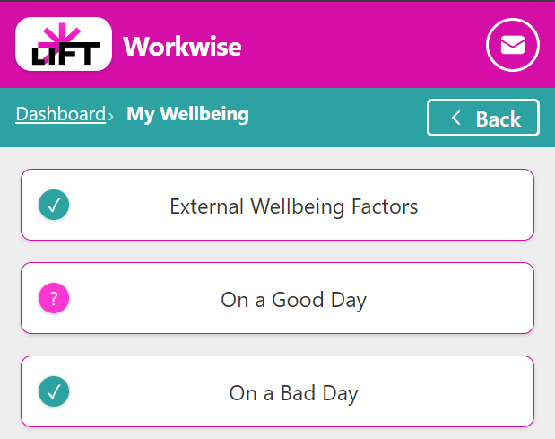
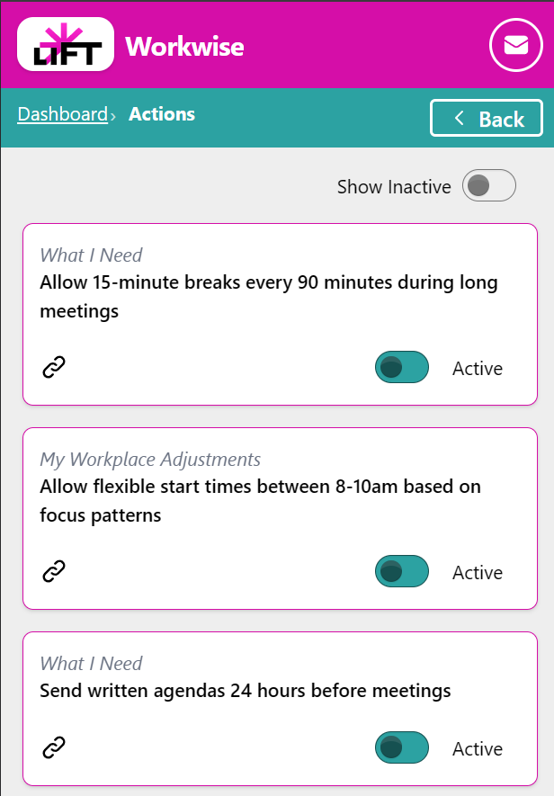
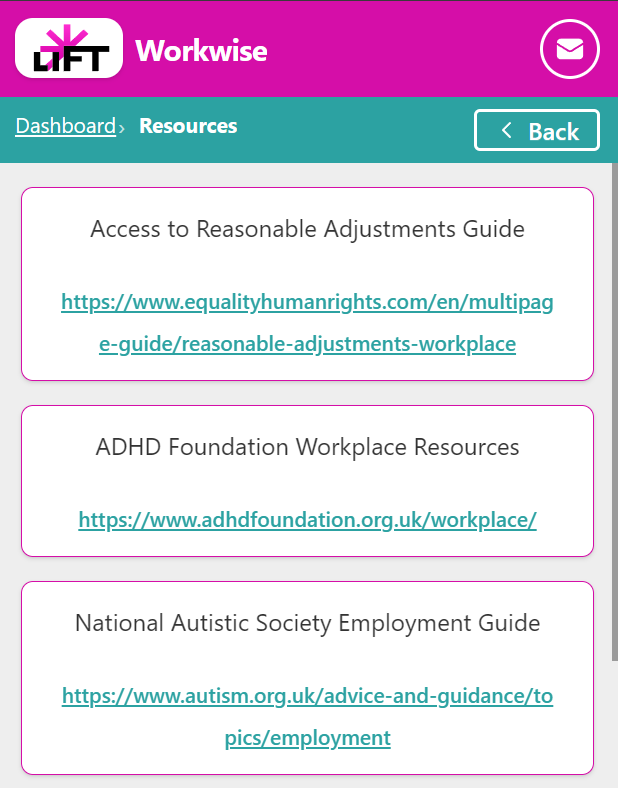
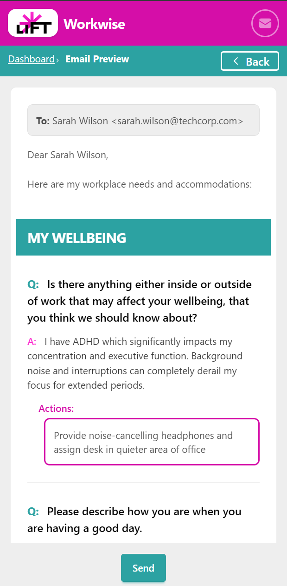

# Workwise User Guide

**Your Digital Workplace Passport**

---

## Table of Contents

1. [Getting Started](#getting-started)
2. [Dashboard Overview](#dashboard-overview)
3. [Managing Your Responses](#managing-your-responses)
4. [Working with Categories](#working-with-categories)
5. [Managing Actions](#managing-actions)
6. [Accessing Resources](#accessing-resources)
7. [Sharing Your Workplace Passport](#sharing-your-workplace-passport)
8. [Privacy and Control](#privacy-and-control)

---

## Getting Started

### Welcome to Workwise

Your Digital Workplace Passport helps you document and share your workplace needs with your line manager, promoting a more inclusive work environment.

<em>Select your profile to get started</em>

### First Steps

To begin using your workplace passport:

1. **Sign in or create an account** - Enter your email address to receive a magic link for secure, password-free authentication
2. **Check your email** - Click the magic link sent to your inbox to access your account
3. **Select your profile** from the dropdown menu (if you have multiple profiles)
4. **Explore the dashboard** - organized into three sections: Actions, Categories, and Resources
5. **Click on any category tile** to start adding your responses
6. **Use the email button** in the header to share your responses with your line manager
7. **Access help anytime** by clicking the 'i' button in the footer

---

## Dashboard Overview

### Understanding Your Dashboard

Your dashboard is organized into three main sections: **Actions** (personal plans), **Categories** (workplace topics), and **Resources** (support materials). Each section contains tiles that allow you to navigate to specific areas.

<em>Dashboard showing Actions, Categories, and Resources sections</em>

### Navigating the Dashboard

#### Actions Section
View and manage your personal action items that help you address workplace challenges.

#### Categories Section
Click category tiles to explore questions and add responses about your workplace needs and preferences.

#### Resources Section
Access helpful workplace support materials and external links.

### Dashboard Controls

- **Email button** (in header): Share your public responses with your line manager
- **Help button** (in footer): Access context-sensitive help for your current view
- **Font size control** (in footer): Adjust text size for comfortable reading
- **Terms and Privacy** (in footer): Review terms of use and privacy policy

---

## Managing Your Responses

### About Responses

Your responses document your workplace needs, preferences, and experiences. You have full control over what you share and with whom. Access your responses by clicking on a question from any category.

<em>Edit responses and control their visibility</em>

### Response Options

When viewing a question, you can:

- **Provide a detailed response** explaining your needs or preferences
- **Mark the question as 'Not Applicable'** if it doesn't apply to you
- **Skip the question** to answer it later
- **Edit or update your response** anytime
- **Delete your response** if you no longer want it saved

### Response Privacy

You control the visibility of each response:

- **Public responses** can be shared with your line manager via email
- **Private responses** remain confidential to you
- **Change visibility settings** anytime using the toggle
- **Only you decide** what information to share
- **Your privacy is always protected**

### Creating Actions from Responses

Once you've provided a response, you can create personal action items to address workplace challenges:

- **Actions can only be created after you've answered a question**
- Click **'Add Action'** to create a personal plan linked to this question
- **Edit or delete actions** anytime to track your progress
- Set actions as **Active/Inactive** to show current priorities
- **Control action visibility** (public/private) to decide what to share
- **Public actions appear in emails** to your line manager

### Navigation

Use the **Back button** in the header to return to the previous view. Your changes are saved automatically as you work.

---

## Working with Categories

### Exploring Categories

Categories group related workplace topics and questions. Each category contains questions you can respond to about your workplace needs and preferences. Click any category tile from the Categories section on your dashboard to begin.

<em>Questions within a category - checkmark shows answered, question mark shows needs attention</em>

### Understanding Question Status

- **Question mark (?)** - Questions that require your attention
- **Checkmark (✓)** - Questions that are already answered or skipped

### Responding to Questions

When exploring categories:

1. Click on any question to add or edit your response
2. Provide detailed, honest responses about your needs
3. Set response visibility (public/private)
4. Navigate back using the **Back button** in the header

---

## Managing Actions

### About Actions

Actions are personal plans you create to help address workplace challenges. Each action is linked to a question from your workplace passport and can be shared with your line manager.

<em>Your personal actions list with Active/Inactive toggles</em>

### Working with Actions

You can manage your actions in several ways:

- **Toggle between Active and Inactive status** for each action
- **Click the link icon** to view the related question
- **Use 'Show inactive' toggle** to see archived actions
- **Set actions as public/private** to control sharing
- **Navigate back to the dashboard** using the Back button in the header

### Sharing Actions

Public actions can be included in emails to your line manager, helping them understand your proactive approach to workplace challenges.

---

## Accessing Resources

### Available Resources

Resources are helpful materials, links, and information related to workplace support and neurodivergent needs. Access them from the Resources section on your dashboard.

<em>Browse available workplace support resources</em>

### Using Resources

Resources can help you:

- Learn about workplace accommodations
- Find support materials for specific challenges
- Access external links and tools (click the URL to open in a new tab)
- Discover best practices for workplace inclusion
- Get guidance on communicating your needs
- Navigate back to the dashboard using the **Back button** in the header

---

## Sharing Your Workplace Passport

### Email Preview

The email preview shows a summary of your public responses and actions that can be shared with your line manager. Access it by clicking the email button in the header.

<em>Preview your workplace passport before sharing</em>

### Before Sending

Review the email content carefully:

- ✓ Check that all information accurately represents your needs
- ✓ Verify only public responses and actions are included
- ✓ There's an optional notes field at the bottom for additional context - use this sparingly since the app is designed to track everything through questions, responses, and actions
- ✓ Remember you control when and what to share
- ✓ Use the **Back button** in the header to return to the dashboard without sending

### Sending the Email

When you're ready, enter your line manager's email address and click send. The email will be sent with a professional summary of your workplace passport, helping facilitate productive conversations about your needs.

---

## Privacy and Control

### Your Data, Your Choice

Workwise puts you in complete control of your workplace passport:

- **All responses start as private** - nothing is shared unless you explicitly make it public
- **Change visibility anytime** - toggle between public and private for any response or action
- **Delete freely** - remove any response or action you no longer want
- **Preview before sending** - always see exactly what will be shared
- **No automatic sharing** - emails are only sent when you click send

### Data Storage

Your workplace passport data is securely stored and only accessible to you. When you share your passport via email, only the items marked as "public" are included in the email to your line manager.

### Getting Help

Access context-sensitive help anytime by clicking the **'i' button** in the footer. The help content will adapt based on what you're currently viewing in the application.

---

## Tips for Success

### Getting the Most from Your Workplace Passport

1. **Be honest and specific** - The more detailed your responses, the better your line manager can support you
2. **Start small** - You don't need to answer everything at once. Focus on the most relevant categories first
3. **Review regularly** - Your needs may change over time. Update your responses as needed
4. **Use actions strategically** - Create actions for challenges you're actively working to address
5. **Control your narrative** - Use the public/private settings to share what feels comfortable
6. **Preview before sharing** - Always review the email preview to ensure you're comfortable with what's being shared

### Need More Help?

- Click the **'i' button** in the footer for context-specific help
- Review the **Terms of Use** and **Privacy Policy** in the footer
- Adjust **font size** in the footer for comfortable reading
- Use the **Back button** to navigate between views

---

*Generated with Workwise - Your Digital Workplace Passport*
